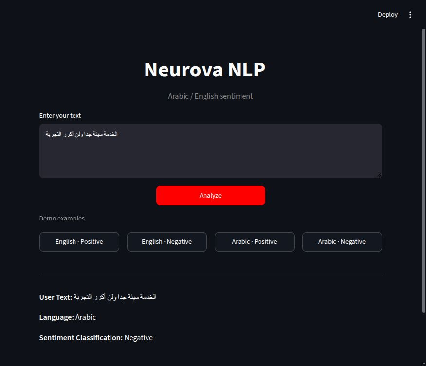

# Neurova NLP — Bilingual sentiment analysis

[Portfolio](../../../README.md) · [Week 1](../README.md)

## Overview

Classical NLP system that detects whether user text is **Arabic or English**, then runs the matching sentiment classifier. No Transformers and no neural networks.

## My contribution

**Abdlrhman Ismail — sole developer of Neurova NLP.** I built the project end to end: Arabic/English preprocessing, language detection, sentiment training and model selection, saved inference pipelines, the Streamlit interface, and automated tests/CI.

- Kept preprocessing shared between training and inference, and saved each fitted vectorizer together with its classifier.
- Removed normalized-text overlap from sentiment train/test splits and split language source reviews before generating derived examples.
- Added input validation and tests for routing, model artifacts, mixed text, and the Streamlit user flow.
- Reported per-class results and failure cases, including weak Arabic Neutral predictions and negation errors.

Implementation history: [initial project](https://github.com/abdlrhmanv/IEEE-SSCS-AUSC-AI-Track/commit/2fdd3cb) · [evaluation and CI](https://github.com/abdlrhmanv/IEEE-SSCS-AUSC-AI-Track/commit/2e6590e) · [validation and overlap fixes](https://github.com/abdlrhmanv/IEEE-SSCS-AUSC-AI-Track/commit/d205572).

## At a glance

| Item | Detail |
| :--- | :--- |
| Interface | Streamlit text input with Arabic and English sample buttons |
| English result | Held-out accuracy **89.96%** |
| Arabic result | Held-out **macro-F1 0.6221**; Neutral remains unreliable |
| Reproducibility | Python 3.13, pinned dependencies, saved models, tests, and CI |

The detailed evaluation below explains the split policy and limitations behind these results.

## Try the demo

Use the [installation steps](#installation), then run `python -m streamlit run app.py` from this project folder. Saved models are included; datasets are only needed for retraining.

1. Click **English · Positive**, then **Analyze**. Expected: `English` / `Positive`.
2. Click **Arabic · Negative**, then **Analyze**. Expected: `Arabic` / `Negative`.
3. Try your own Arabic or English review. See [limitations](#limitations) for negation, mixed language, and Neutral caveats.

| English sample | Arabic sample |
| :---: | :---: |
|  |  |

These screenshots show actual inference from the local application, captured on **6 October 2026**. There is currently no hosted demo linked from this portfolio.

The app shows the three fields required by the assignment brief:

| Field | Values |
| :--- | :--- |
| User Text | original input |
| Language | `Arabic` or `English` |
| Sentiment Classification | `Positive` / `Negative` (Arabic also `Neutral`) |

## Architecture

```text
User Text
    → validate (empty / no letters / empty after preprocess → error)
    → Language preprocessing          preprocess_language_detection
    → Fitted char TF-IDF (2–5)
    → Linear SVM
         ├─ Arabic  → preprocess_arabic  → fitted char TF-IDF (char_wb 3–5) → Logistic Regression
         └─ English → preprocess_english → fitted word TF-IDF (1–2) → Linear SVM
    → { User Text, Language, Sentiment Classification }
```

Runtime language detection is the saved sklearn Pipeline. There is no Unicode/script shortcut for Arabic vs English.

The brief does not define mixed Arabic+English input. Mixed-script strings are classified by the same SVM. Training includes a small set of mixed rows labeled Arabic because Arabic reviews in this dataset often contain Latin product names (`iPhone`, `AI`). Observed examples after the leak-free split: `iPhone ممتاز` → Arabic, `hello مرحبا` → English.

Digits, punctuation, or emoji with **no letters** are rejected before classification. Arabic digits, Arabic punctuation, and tashkeel-only strings are not treated as letters. URL-only or HTML-only input still contains Latin letters, then becomes empty after preprocessing and raises `EmptyAfterPreprocessError` (not a broad `except`). These checks are robustness additions, not brief requirements.

## Datasets

The CSVs are gitignored (too large for Git). Download them only if you want to **retrain**:

| Language | Path | Source |
| :--- | :--- | :--- |
| Arabic | `data/raw/arabic/Final_Data.csv` | [Arabic customer reviews](https://www.kaggle.com/datasets/mohamedramadan2040/arabic-customer-reviews) |
| English | `data/raw/english/MovieReviewTrainingDatabase.csv` | [IMDb binary sentiment](https://www.kaggle.com/datasets/mwallerphunware/imbd-movie-reviews-for-binary-sentiment-analysis) |

English is **binary** (`Positive` / `Negative`). Arabic is **3-class** (`Positive` / `Negative` / `Neutral`). Neutral is not a class for English.

Inference does **not** need the CSVs. The three `models/*.pkl` files are tracked in Git (about 1.4–2.6 MB each, under GitHub’s 100 MB file limit). Git LFS is not used.

<a id="repository-structure"></a>

## Contents

Folder guides: [Source](src/README.md) · [Models](models/README.md) · [Data](data/README.md) · [Notebooks](notebooks/README.md) · [Scripts](scripts/README.md) · [Tests](tests/README.md).

```text
NLP/Week1/Project1/
├── app.py
├── requirements.txt
├── src/
│   ├── Preprocessing_pipeline.py   # required
│   ├── English_model.py            # required
│   ├── Arabic_model.py             # required
│   ├── language_model.py
│   ├── language_dataset.py
│   ├── sentiment_dataset.py
│   ├── pipeline.py
│   └── validation.py
├── notebooks/
│   ├── Training_english_model.ipynb            # required
│   ├── Training_arabic_model.ipynb             # required
│   └── Training_language_classifier.ipynb      # required
├── models/
│   ├── Arabic_model_weights.pkl                # required
│   ├── English_model_weights.pkl               # required
│   └── Language_classifier_weights.pkl         # required
├── data/raw/{arabic,english}/                  # CSVs not in Git
├── scripts/retrain.py
└── tests/
```

Clone path in this portfolio repo:

```bash
git clone https://github.com/abdlrhmanv/IEEE-SSCS-AUSC-AI-Track.git
cd IEEE-SSCS-AUSC-AI-Track/NLP/Week1/Project1
```

## Preprocessing

Training and inference import the same functions:

| Function | Steps |
| :--- | :--- |
| `preprocess_english` | lowercase → URLs/HTML → contraction expansion (`wasn't` → `was not`) → unwanted chars → whitespace |
| `preprocess_arabic` | URLs → emoji → punctuation → tashkeel → tatweel → Alef → Ya → whitespace |
| `preprocess_language_detection` | lowercase → URLs/HTML → keep letters (any script) |

Arabic stopwords stay off by default so `مش حلو` does not become `حلو`.

<a id="feature-extraction-and-models"></a>

## Results and models

Classical only: Bag of Words, word TF-IDF, word n-grams, character n-grams, FeatureUnion.

Winner per pipeline is chosen on a **validation** split (test is held out). Language-ID sources are split **before** derived examples are created. Sentiment rows are grouped by **normalized** text before splitting.

| Pipeline | Selected model | Features | Held-out test |
| :--- | :--- | :--- | :--- |
| Language | Linear SVM | Char TF-IDF (2–5) | Accuracy / macro-F1 **0.9996** |
| English | Linear SVM | Word TF-IDF (1–2 grams) | Accuracy **0.8996**, Positive F1 **0.9002** |
| Arabic | Logistic Regression (`class_weight=balanced`) | Character n-grams (char_wb 3–5) | Accuracy **0.7787**, **macro-F1 0.6221** |

Fixing train/test overlap lowered English accuracy from **0.9010 → 0.8996** and Arabic accuracy from **0.8130 → 0.7787**. Arabic macro-F1 moved **0.6240 → 0.6221**. After the leak-free split, validation selected character n-grams instead of word+char n-grams. Language accuracy stayed **0.9996** on a slightly different test size.

<details>
<summary>Evaluation details, overlap policy, and confusion matrices</summary>

### Sentiment overlap policy

1. Map each review with the same preprocess used at inference.
2. Drop empty normalized strings.
3. If one normalized string has **conflicting labels**, drop every copy.
4. If labels agree, keep a single row.
5. Split the unique normalized strings. Vectorizer fitting and Neutral oversampling stay inside training folds.

| Dataset | Unique after policy | Conflict groups (rows dropped) | Same-label dups dropped | Train/test normalized overlap |
| :--- | ---: | ---: | ---: | ---: |
| English | 24901 | 0 (0) | 99 | **0** |
| Arabic | 36643 | 180 (978) | 1720 | **0** |

### Language overlap

Source-id overlap is **0** (duplicate source reviews that normalize to the same isolated text share an id; **625** extras were merged). That is not the same as zero normalized-text overlap. Short derived slices and synthetic phrases can still match across different sources:

| Measure | Count |
| :--- | ---: |
| Train rows | 110948 |
| Test rows | 27674 |
| Unique normalized strings in both partitions | 3321 |
| Test rows whose normalized text was seen in train | 8382 |
| Test rows whose normalized text is absent from train | 19292 (Arabic 10447, English 8845) |
| Unseen-normalized accuracy / macro-F1 | **0.9999** |

Those overlapping short phrases are left in the evaluation. The unseen-normalized slice is reported separately.

Pickles store the **entire** sklearn Pipeline (fitted vectorizer + classifier). Inference never fits a new vocabulary.

### Language confusion matrix

Labels `['Arabic', 'English']`:

|  | Pred Arabic | Pred English |
| :--- | ---: | ---: |
| **True Arabic** | 13835 | 2 |
| **True English** | 8 | 13829 |

### English confusion matrix

Labels `['Negative', 'Positive']`:

|  | Pred Negative | Pred Positive |
| :--- | ---: | ---: |
| **True Negative** | 2226 | 261 |
| **True Positive** | 239 | 2255 |

### Arabic confusion matrix and Neutral

Labels `['Negative', 'Neutral', 'Positive']`:

|  | Pred Negative | Pred Neutral | Pred Positive |
| :--- | ---: | ---: | ---: |
| **True Negative** | 2156 | 286 | 276 |
| **True Neutral** | 116 | 132 | 116 |
| **True Positive** | 379 | 449 | 3419 |

Neutral is about 5% of the Arabic data and the labels are noisy. After class weighting and train-fold oversampling:

| Class | Precision | Recall | F1 |
| :--- | ---: | ---: | ---: |
| Negative | 0.813 | 0.793 | 0.803 |
| Neutral | 0.152 | 0.363 | 0.214 |
| Positive | 0.897 | 0.805 | 0.849 |

Neutral is still not reliable. Macro-F1 is the honest metric; accuracy overstates quality.

</details>

## Installation

Python **3.13** was used for the saved weights (`scikit-learn==1.9.0`). Use the pinned versions in `requirements.txt` so pickle load stays compatible.

```bash
cd NLP/Week1/Project1
python3.13 -m venv .venv
source .venv/bin/activate
python -m pip install -r requirements.txt
```

If `python3.13` is not on your PATH, `python3 -m venv .venv` is fine when that interpreter is 3.13.

<a id="how-to-run"></a>

## Run locally

```bash
python -m streamlit run app.py
python -m pytest tests/ -q
```

The app: type Arabic or English text, click **Analyze**. Demo buttons fill the text box; click Analyze afterward.

## Example usage

```python
from src.pipeline import NeurovaNLPPipeline

nlp = NeurovaNLPPipeline.load()
print(nlp.analyze("I absolutely loved this movie."))
# {'User Text': '...', 'Language': 'English', 'Sentiment Classification': 'Positive'}

print(nlp.analyze("الخدمة سيئة جدا ولن أكرر التجربة"))
# {'User Text': '...', 'Language': 'Arabic', 'Sentiment Classification': 'Negative'}
```

| Input | Language | Sentiment |
| :--- | :--- | :--- |
| I absolutely loved this movie. | English | Positive |
| This was one of the worst movies I've ever watched. | English | Negative |
| الخدمة ممتازة والتجربة كانت رائعة | Arabic | Positive |
| الخدمة سيئة جدا ولن أكرر التجربة | Arabic | Negative |

Empty text raises `EmptyTextError`. Input with no Arabic or English letters raises `NonLinguisticTextError`. URL/HTML-only input that becomes empty after preprocessing raises `EmptyAfterPreprocessError`. Corrupted pickles raise `RuntimeError`. All three validation errors show the same friendly warning in the Streamlit UI.

## Retraining

Place the two CSVs under `data/raw/` as in the table above, then:

```bash
# notebooks (open from the notebooks/ directory, or in Jupyter)
# Training_english_model.ipynb
# Training_arabic_model.ipynb
# Training_language_classifier.ipynb

python scripts/retrain.py                 # all three models
python scripts/retrain.py --language-only # language classifier only
```

`models/training_metrics.json` is rewritten by the script. Sentiment notebooks must be re-run if you change those models.

## Limitations

- **Negation scope** — `The movie wasn't bad` and `الفيلم مش وحش` are often still predicted Negative. After leak-free retraining, `المنتج لا يستحق المال` is also predicted Positive. Expanding English contractions helps tokenization; character n-grams do not model “not + bad = good.”
- **Sarcasm** — `Great, another terrible movie.` is not understood as a rhetorical device.
- **Very short text** — `ok` / `تمام` have little sentiment signal (language ID works; polarity is weak).
- **Arabic Neutral** — rare and noisy; macro-F1 remains much lower than accuracy.
- **Mixed language** — classified by the SVM; Latin-heavy mixed strings may be English, product-name mixes may be Arabic.
- **Slang and dialect** — sparse in TF-IDF.
- **Unsupported scripts** — Chinese/Cyrillic/etc. with no Arabic or Latin letters are rejected as non-linguistic. French/German look like English to the detector.
