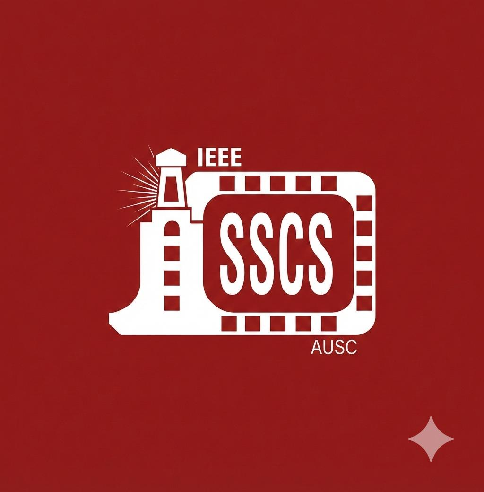
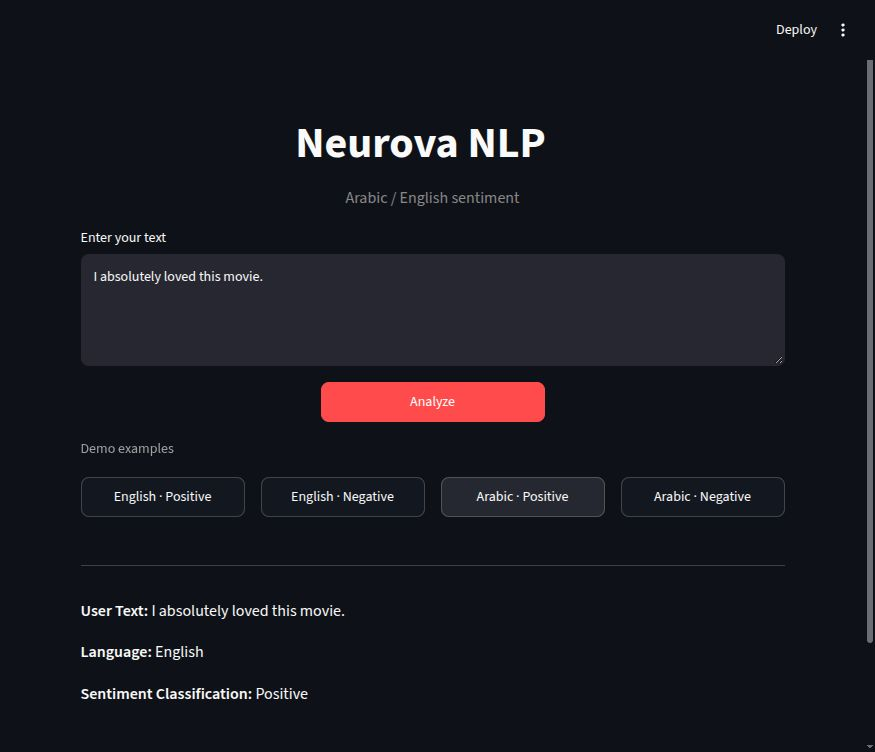
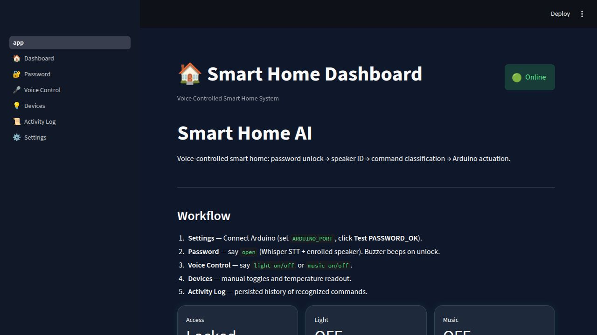
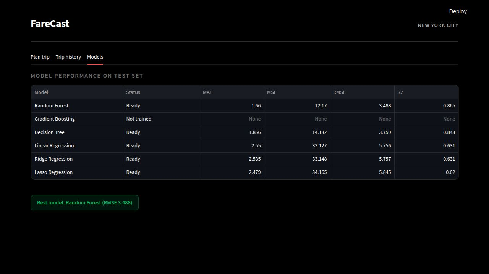

<h1 align="center">IEEE SSCS AUSC — AI Track Portfolio</h1>

<p align="center">
  
</p>

<p align="center">
  <em>Coursework and projects from the IEEE Solid-State Circuits Society<br/>
  Alexandria University Student Chapter AI track</em>
</p>

<p align="center">
  <a href="https://www.python.org/"></a>
  <a href="https://numpy.org/"></a>
  <a href="https://pandas.pydata.org/"></a>
  <a href="https://matplotlib.org/"></a>
  <a href="https://scikit-learn.org/"></a>
</p>

---

## About

I'm **Abdlrhman Ismail**, a Senior Computer Engineering student at **Ain Shams University (ASU)** and a member of the **AI Committee** at IEEE SSCS AUSC.

I build Python applications that connect machine learning to usable interfaces: bilingual sentiment analysis, voice-controlled hardware, and fare prediction. This portfolio brings together my projects and the coursework behind them.

[LinkedIn](https://www.linkedin.com/in/abdlrhmanv) · [Email](mailto:abdlrhmanv@icloud.com) · [GitHub](https://github.com/abdlrhmanv)

## Featured projects

| Project | Problem & approach | Result / scope | Explore |
| :--- | :--- | :--- | :--- |
| **Neurova NLP**<br>Solo developer | Detect Arabic or English and route text to a matching sentiment model. TF-IDF + classical classifiers + Streamlit. | English test accuracy **89.96%**; Arabic **macro-F1 0.6221**. Arabic Neutral remains weak. | [Project & results](NLP/Week1/Project1/README.md) · [Try locally](NLP/Week1/Project1/README.md#try-the-demo) |
| **Smart Home Voice Control**<br>Team: architecture & integration | Turn spoken commands into light/music actions using Whisper, speaker identification, and Arduino serial control. | Authentication, command rejection, and temperature readout. Unseen-speaker performance remains weak. | [My contribution](Machine-Learning/Project2/README.md#my-contribution) · [Demo walkthrough](Machine-Learning/Project2/README.md#demo-walkthrough) · [Source](https://github.com/abdlrhmanv/smart-home-voice-control) |
| **FareCast — Uber fare prediction**<br>Team: regression & preprocessing | Estimate fares from trip coordinates and engineered time/distance features, with a map-based Streamlit interface. | The team README reports a model-scaling issue; fare estimates need validation. | [My contribution](Machine-Learning/Project1/README.md#my-contribution) · [Demo walkthrough](Machine-Learning/Project1/README.md#demo-walkthrough) · [Source](https://github.com/AliMohamed3122005/UberPricePredictionProject) |

Neurova's evaluation and limitations are documented in its project README. Smart Home and FareCast are maintained in their linked repositories.

### Project previews

| Neurova NLP | Smart Home | FareCast |
| :---: | :---: | :---: |
| [](NLP/Week1/Project1/README.md#try-the-demo) | [](Machine-Learning/Project2/README.md#demo-walkthrough) | [](Machine-Learning/Project1/README.md#demo-walkthrough) |
| Real English inference; Arabic example in project notes. | Local dashboard preview; hardware disconnected. | Saved model metrics screen; fare validation still required. |

### Quick start — Neurova

```bash
git clone https://github.com/abdlrhmanv/IEEE-SSCS-AUSC-AI-Track.git
cd IEEE-SSCS-AUSC-AI-Track/NLP/Week1/Project1
python3.13 -m venv .venv
source .venv/bin/activate
python -m pip install -r requirements.txt
python -m streamlit run app.py
```

Click **English · Positive**, then **Analyze**; repeat with **Arabic · Negative**. Saved models are included, so no dataset download or retraining is needed. Installation time depends on your connection. Windows: activate with `.venv\Scripts\activate`.

Demo access is local. FareCast's published tunnel was offline when checked on **6 October 2026**; use its walkthrough. Smart Home's physical actions require the team hardware setup.

## Learning journey

The coursework follows two chronological phases:

1. **Machine Learning** — weekly tasks, then Project 1 and Project 2
2. **Natural Language Processing** — NLP team work after the ML phase

---

## Repository structure

```text
IEEE-SSCS-AUSC-AI-Track/
├── assets/                # IEEE logo + real project previews
├── Machine-Learning/
│   ├── Tasks/Task0 … Task10
│   ├── Project1/          # FareCast contribution notes + demo walkthrough
│   └── Project2/          # Smart Home contribution notes + demo walkthrough
├── course-materials/      # Assignment briefs, slides, lecture examples
└── NLP/
    └── Week1/
        ├── Task0/         # vector rotation notebook + Streamlit interface
        └── Project1/      # Neurova NLP
```

Details: [Machine Learning](Machine-Learning/README.md) · [NLP](NLP/README.md) · [Course materials](course-materials/README.md)

---

## Phase 1 — Machine Learning

Browse the [task index](Machine-Learning/Tasks/README.md) for folder guides and individual setup instructions.

|  #  | Item | Description | Status |
| :-: | :--- | :---------- | :----: |
| 00 | [Task 0](Machine-Learning/Tasks/Task0) | Matrix operations from scratch + research | Done |
| 01 | [Task 1](Machine-Learning/Tasks/Task1) | NumPy + linear regression (normal equation) | Done |
| 02 | [Task 2](Machine-Learning/Tasks/Task2) | Titanic EDA (Pandas) | Done |
| 03 | [Task 3](Machine-Learning/Tasks/Task3) | Matplotlib & Seaborn | Done |
| 04 | [Task 4](Machine-Learning/Tasks/Task4) | Zara sales EDA | Done |
| 05 | [Task 5](Machine-Learning/Tasks/Task5) | California Housing regression | Done |
| 06 | [Task 6](Machine-Learning/Tasks/Task6) | Polynomial regression (Auto MPG) | Done |
| 07 | [Task 7](Machine-Learning/Tasks/Task7) | Logistic regression from scratch | Done |
| 08 | [Task 8](Machine-Learning/Tasks/Task8) | Validation tuning + categorical encoding comparison | Done |
| 09 | [Task 9](Machine-Learning/Tasks/Task9) | Stacking + Optuna | Done |
| 10 | [Task 10](Machine-Learning/Tasks/Task10) | DT / SVM / RF + SVM kernels report | Done |
| P1 | [Project 1](Machine-Learning/Project1) | Uber price prediction (team repo) | Separate repo |
| P2 | [Project 2](Machine-Learning/Project2) | Smart Home voice control | Separate repo |

---

## Phase 2 — Natural Language Processing

Browse the [Week 1 index](NLP/Week1/README.md) for the vector-rotation task and Neurova project.

| Item | Description | Status |
| :--- | :---------- | :----: |
| [Task 0](NLP/Week1/Task0/README.md) | Vector rotation notebook + Streamlit interface | Implemented |
| [Neurova Project 1](NLP/Week1/Project1/README.md) | Bilingual sentiment analysis | Implemented · tested |
| [Week 1 materials](course-materials/NLP/Week1) | Assignment brief + lecture examples | Reference |

---

## Getting started

Tasks and projects use separate dependencies. Each task README lists its installation commands, working directory, and entry point. Neurova has a tested Python 3.13 quick start above.

For coursework, create and activate an environment from the repository root, then follow the chosen task’s README:

```bash
python3 -m venv .venv-coursework
source .venv-coursework/bin/activate
```

Windows Command Prompt: activate with `.venv-coursework\Scripts\activate`.

ML Task 0 uses the Python standard library. Notebook requirements include Jupyter. Keep separate environments for coursework and Neurova, whose saved models use pinned package versions.

FareCast and Smart Home run from their linked source repositories. Their portfolio write-ups describe installation, ownership, and demo limits.

---

## AI assistance

Some notebook markdown explanations and documentation comments were drafted with AI assistance, then reviewed for submission.

---

## License and sources

Original code and associated documentation are licensed under [MIT](LICENSE). Datasets, course references, images, branding, model artifacts, and linked team code retain their own rights; see [scope and attribution](THIRD_PARTY_NOTICES.md).

## Contact

| | |
| --- | --- |
| Email | [abdlrhmanv@icloud.com](mailto:abdlrhmanv@icloud.com) |
| LinkedIn | [Abdlrhman Ismail](https://www.linkedin.com/in/abdlrhmanv) |
| GitHub | [@abdlrhmanv](https://github.com/abdlrhmanv) |
